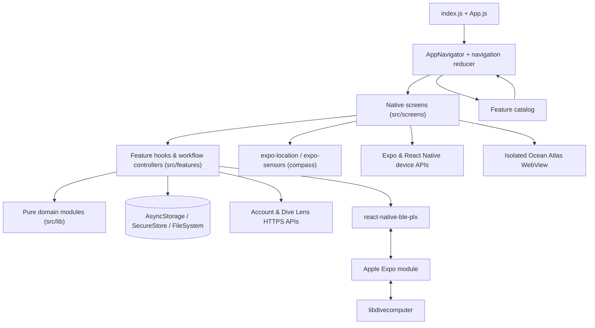

# DMZ Scuba

> **Pre-alpha 0.0.104** — active development. Data models, workflows and visual
> design can still change before the first public alpha.

DMZ Scuba is an [Expo](https://expo.dev/) / React Native companion for divers who
have outgrown a pile of disconnected single-purpose apps. It combines a serious
local-first logbook, direct dive-computer downloads, a setup-aware Gear Locker,
the data-rich Ocean Atlas, travel planning, calculators, practical training labs,
photo organization, Dive Lens identification and shareable dive cards.

The important part is not the feature count. The same dive computers that create
logbook records become tracked equipment. Logged coordinates appear in the Atlas.
The Atlas connects site conditions and the diver's own temperature preferences to
real saved gear setups. Travel guidance starts from the same location being
researched. Home turns all of that into a personal dashboard. DMZ Scuba is being
built as one connected diving system rather than a folder of unrelated tools.

This README serves two audiences:

- **[Product tour](#product-tour)** — what the app can do and how its parts work
  together, without requiring software knowledge.
- **[Under the hood](#under-the-hood)** — architecture, data models, native
  integrations, storage, datasets, algorithms and the development workflow.

> [!IMPORTANT]
> DMZ Scuba's calculators, simulations, navigation practice, safety scores, and
> AI identifications are **educational and organizational tools**. They do not
> replace formal training, manufacturer instructions, a properly configured real
> dive computer, gas analysis, equipment inspection, or conservative real-world
> dive planning.

---

## Current status

This is a functional **pre-alpha**, not a store-ready release. The major native
workflows are implemented and covered by focused regression scripts, but the app
still needs broader physical-device testing, accessibility work, content review,
production service hardening and public-alpha migration guarantees. The current
version deliberately uses the repository commit number as its patch version:
this release is commit 104, therefore `0.0.104`.

DMZ Scuba is local-first and useful while signed out. Network access is needed
for detailed OpenStreetMap tiles, account sync, Dive Lens, some travel links and
the remaining hosted content. Direct dive-computer download requires a full iOS
build and compatible hardware; it does not run in Expo Go.

## Project at a glance

| Tab | What the diver sees | How it works |
| --- | --- | --- |
| **Home** | Greeting, dive totals, last dive, download/manual actions, gear-service alerts, quick tools, seasonal wildlife and lessons | Live summaries from the logbook, Gear Locker, Ocean Atlas seasons and feature catalog |
| **Learn** | Native Color Loss, Boyle's Law, Compass Navigation and Dive Computer labs; Build a Scuba Unit remains coming soon | Shared lab landings, guided tasks and free exploration over testable domain models |
| **Tools** | Ocean Atlas, calculator, Gear Locker, Logbook and Dive Lens | Connected native workflows backed by pure calculation, planning and storage modules |
| **Logbook** | Manual dives, real computer downloads, reconciliation, charts, gallery, filters, statistics, exports and backups | Canonical dives plus preserved per-computer evidence and an Apple libdivecomputer bridge |
| **More** | Account and app settings | Supabase auth, DMZScuba.com account APIs, Turnstile, SecureStore, debounced settings sync |

Everything discoverable in Learn and Tools is generated from **one feature
catalog** (`src/features/catalog/featureCatalog.js`), so public labels and routes
do not become separate, conflicting lists.

## Product tour

### One connected system

| What happens | What DMZ Scuba connects |
| --- | --- |
| A dive is downloaded from two computers | Both raw machine logs are retained, their profiles and clocks are compared, and one human-facing dive is shown instead of double-counting it |
| One computer records a long dive while another splits it | Profile shape, timing and sequence evidence can propose one canonical dive with multiple logs; uncertain decisions go to the diver |
| The diver imports camera-roll photos | Capture time is compared with dive intervals, likely matches are reviewed on-device, duplicates are skipped and photo depth is interpolated from the profile |
| A computer appears in downloaded dives | It is automatically represented in the Gear Locker and links back to the dives recorded with it |
| A diver builds a saved setup | Linked components, cylinder sets, floating items, drysuit undergarments, packing state and one-time completeness questions stay organized together |
| A site is opened in the Ocean Atlas | Conditions, depth, terrain, seasons, travel complexity and the diver's declared setup uses inform a read-only gear proposal |
| A cold- or warm-running diver plans exposure protection | Personal suit ranges or detailed suit/layer/hood/glove combinations refine the generic guidance without changing the saved setup |
| A logged dive has coordinates | It appears as a private Atlas pin and opens the real editable logbook record; full notes, profiles and photos never enter the map WebView |
| Home opens | It summarizes the logbook, surfaces equipment service needs, links directly into download/manual logging and highlights what is seasonally relevant now |

These are planning and organization connections, not automated authority. The
app never infers technical training from owning doubles, never treats a saved
setup as proof that a dive is appropriate, and never silently edits a setup from
an Atlas suggestion.

### The five main spaces

1. **Home** is the dashboard: recent diving, the two fastest logbook actions,
   equipment needing attention, quick tools, wildlife in season and lessons.
2. **Learn** turns dive concepts and instrument skills into guided interaction,
   then leaves the controls open for exploration.
3. **Tools** collects the Atlas, calculator, Gear Locker, Logbook and Dive Lens.
4. **Logbook** is the historical center: manual and downloaded dives are
   reconciled, reviewed, searched, analyzed, photographed, exported and shared.
5. **More** holds account, profile and app settings.

A lesson or tool opens as a temporary detail screen; **Back** returns to what
opened it, including Android's hardware Back button.

### What stays on the phone and what leaves it

The app is deliberately local-first. A few features are connected services and
are always opt-in or explicit.

| Information or feature | Local or online? |
| --- | --- |
| Dive records, downloaded profile samples, reconciliation decisions | Stored locally on the device |
| Gear inventory, components, setups, packing state, service records, photos and PDFs | Stored locally on the device |
| Logbook photos | Matching stays on-device; confirmed photos are copied into app-managed storage and never uploaded |
| Coarse location breadcrumbs | Stored locally, only after the diver opts in, kept 90 days |
| Unit / calculator / graph / location preferences | Stored locally; supported settings also sync to a signed-in account |
| Compass heading and device tilt | Read from the phone's own sensors; nothing is transmitted |
| Share-card preferences | Stored locally; the chosen background photo is not remembered between dives |
| Account profile and certifications | Stored through the online DMZ Scuba account service |
| Account refresh token | Stored in the device's secure credential storage |
| Dive Lens image | Sent to the DMZ media API **only** when the diver taps identify |
| Color-loss, Boyle's Law, Compass and Dive Computer labs | Native app experiences; sensor/camera modes use only the local device |
| Ocean Atlas core datasets and world map | Bundled in the app; detailed OpenStreetMap tiles and outbound source/travel links use the network |
| Atlas gear preferences and proposals | Stored and calculated locally; locker inventory never enters the Atlas WebView |
| Real dive-computer download | Runs locally over Bluetooth in a full iOS build |

### A typical diver journey

A new user can explore every lesson and calculator, run the compass lab, and
enter dives by hand with **no account and no network**. On a compatible full iOS
build they can also connect a physical dive computer over Bluetooth and download
its history.

Each physical download is preserved as a *computer log*. The app then works out
whether two logs from different computers describe the same real dive. If they
do, it shows one dive in the logbook while keeping both computers' evidence
underneath — the diver picks which computer is primary, inspects each recorded
profile, and corrects clock differences when needed.

Downloaded computers also appear in the Gear Locker, where the diver can build
real single-tank, doubles, sidemount, rebreather, bailout or custom setups rather
than maintaining a flat inventory. The same locker can later provide a read-only
packing proposal for a site opened in the Ocean Atlas, including personal
exposure combinations and service/condition warnings.

After a trip the diver can select a large batch of camera-roll images. Capture times
are compared with dive times, likely matches are shown for review, duplicates are
skipped, and uncertain photos are assigned by hand. A linked image can be viewed
in the gallery or used as the background for a share card.

JSON backups, CSV exports, and UDDF exports give the diver a path to move or
inspect their data outside the app. Those same logged sites become the diver's
private map layer, connecting history with future destination research.

---

## Feature-by-feature overview

### Home and navigation

`App.js` is deliberately tiny: it applies portrait-orientation behaviour,
safe-area support, the light status bar, the application navigator, and the
shared number-keyboard accessory. `index.js` registers the background-location
`TaskManager` task **before React mounts** (iOS can cold-start the app in the
background purely to deliver a location update).

`AppNavigator` (`src/application/`) owns the current tab and any temporary detail
route through a small **reducer** — no third-party navigation library. The five
persistent tabs are Home, Learn, Tools, Logbook, and More. Android's hardware
Back button drives the same navigation state as the on-screen controls.

Home is a dashboard rather than another menu. Its hero combines the greeting
with live dive count, bottom time, deepest dive and most recent dive. **Download
dives** is the primary action and remembers the last-used computer; **Log
manually** is secondary. Below that, Home surfaces equipment service due soon,
four quick-access tools, an **In season** rail from the Atlas's sourced seasonal
guides, and a lesson rail. Task-specific logbook routes open directly into new,
download or computer-folder workflows instead of making the diver navigate the
logbook again.

### Education

#### Underwater Color Loss (native lab)

Runs entirely in React Native. Drag a vector diver through a 0–40 m water column,
recolour the mask/suit/tank/fins, apply orange / pink / yellow "safety" colours,
and sweep a flashlight across the diver, fish, and coral. Water presets change
absorption; surface-vs-depth swatches and RGB transmission bars explain the
result. Scene artwork lives in `src/features/colorLoss/ColorScene.js` with no
downloaded sprite dependency.

`src/features/colorLoss/model.js` supplies a shared **4×5 RGB transform** for both
the scene and the live camera. Its exponential absorption coefficients come from
the website lab; the native version drops the website's colour-specific
visibility floors and uses a normalised haze matrix so depth zero preserves the
original image exactly. Safety colours are treated as ordinary pigments, not a
fluorescence simulation. Background objects use their own depth; the movable beam
restores nearby colour with a short light path and soft distance falloff. This is
an educational approximation, not a calibrated visibility or product-safety
predictor.

Camera mode uses the local `modules/color-loss-camera` Expo module — AVFoundation
+ Core Image on iOS, CameraX + a `TextureView` colour matrix on Android. Frames
stay native, are never sent over the JavaScript bridge, and are never recorded or
uploaded. The slider applies the same depth transform to the real feed; holding
**Compare** shows the original. Camera access is requested only after **Enable
Camera**, and the camera view unmounts when the app backgrounds or the user
leaves camera mode. Permission denial and unavailable hardware have explicit
recovery states.

Because this feature adds native code, adding the camera module requires a native
rebuild (`npx expo run:ios` / `run:android`); an over-the-air JS update cannot add
it. The reef scene still works when the module is absent. `npm run test:color-loss`
covers the colour model.

#### Boyle's Law Lab (native lab)

Makes pressure ↔ gas-volume behavior visible in a fully native scene. The
compression mode lets the student carry an open or sealed gas space through the
water column and observe expansion, compression and a deliberately simplified
burst demonstration. Breathing mode makes depth-dependent gas use tangible by
spending a finite cylinder one breath at a time. The guided flow asks for real
control actions and prediction checks; Explore leaves the lab open for free play.
All calculations remain in `src/features/boylesLaw/model.js` and are covered by
`npm run test:boyles-law`.

#### Compass Navigation (native lab)

A hands-on lab for underwater compass technique that uses the **phone's own
magnetometer and accelerometer**. The compass rose (`CompassRose.js`) draws the
three parts a diver actually uses:

- the **lubber line** — fixed, "an extension of your body", shows where you face;
- the **compass card** — magnetically stabilised, rendered rotated by
  `-heading` so its red N always points to magnetic north on screen;
- the **rotating bezel** — a full 360° degree ring the diver turns to store a
  course, with an index gate that brackets the card's north.

`useCompassHeading.js` subscribes to `expo-location`'s `watchHeadingAsync`
(`trueHeading` when a location permission is granted, otherwise `magHeading`),
throttled to ~12 Hz, and to `expo-sensors` `Accelerometer` for the gravity
vector. Past ~18° of tilt the reading **freezes and the card "binds"**, exactly
like a real capsule compass — the tilt bubble goes amber. On a device with no
magnetometer (or the iOS Simulator) a **manual mode** is offered automatically:
drag the card to turn, drag a slider to tilt.

The guided lesson (`model.js`, `buildLessonSteps`) has four sections:

1. **The compass** — learn the lubber line, card, and bezel, and the keep-it-level
   rule. Each "learn" step unlocks once the diver has actually turned or spun the
   dial far enough.
2. **Surface navigation** — sight two distant objects; for each, lock the heading,
   set bezel north over card north without turning your body, then "swim" ten
   paces holding the alignment.
3. **Reciprocal navigation** — two complete out-and-back drills on randomly
   generated courses that are always ≥ 90° apart: set the outbound course on the
   bezel, turn your body onto it, travel ten paces, rotate **bezel N onto card S**
   to program the exact reciprocal, turn 180°, and travel the same count back.
4. **Recap** — the physical sequence in six lines.

During any "hold" step, drifting more than 18° off course **stops the pace count**
and shows a "turn left/right N°" cue with a curved on-screen arrow until the diver
corrects. A side-window camera view can place the compass against the diver's
surroundings while keeping the instrument controls available. A separate
**Explore** mode drops all lesson gating so the compass can be handled freely.
`npm run test:compass-nav` covers heading math, side-window behavior, step shape
and every gate.

#### Build a Scuba Unit (coming soon)

A drag-to-assemble lab for rigging a cylinder, BCD, and regulator in the right
order. It is fully built and its checks pass, but it is **held behind a "Coming
soon" screen** pending finished illustrations — flip `GEAR_SETUP_ENABLED` in
`AppNavigator.js` to re-enable it. `npm run test:gear-setup` covers the model.

#### Dive Computer Trainer (native simulator)

Fully native, with two layers:

- **Guided lesson** — a structured course covering the two-button interface,
  menus, date/time, dive activation, NDL, controlled ascent, safety and deep
  stops, rapid-ascent warnings, Nitrox / MOD, planning, logbook navigation, and a
  final knowledge / practical check.
- **Free practice** — a simulator workspace with guided-dive, ascent-control, and
  decompression-response scenarios.

The displayed computer behaves like a small physical instrument, not a set of
mobile tabs: short vs. long button presses mean different things, the LCD depth
graph controls navigation, and warnings or stops temporarily change what the
device presents. See the [simulation architecture](#simulation-architecture).

### Dive Calculator

Five tabs (`src/features/calculator/calculatorTabs.js`). Every calculation lives
in a pure JavaScript module so it can be tested without a screen.

| Tab | Capabilities |
| --- | --- |
| **Pressure** | Depth → absolute pressure and absolute pressure → depth |
| **Nitrox** | Partial pressure, maximum operating depth, best mix, equivalent air depth, and optional equivalent narcotic depth |
| **Blending** | Partial-pressure Nitrox / Trimix fills, banked-mix top-offs, required bleed-down, oxygen / helium / air steps |
| **Gas Use** | Observed RMV from a completed dive, and required gas at depth with a contingency reserve |
| **Deco** | A Bühlmann ZH-L16C tissue snapshot with a selectable gradient factor and optional helium |

Divers can save a cylinder profile or pick a built-in tank preset
(`src/lib/tankProfiles.js`). Metric / imperial conversion happens only at the
input and display boundary — calculations run in canonical metric internally.
Trimix mode is opt-in so helium controls stay out of the way for recreational
Nitrox users. `npm run test:calculator` and `npm run test:tanks` cover this area.

### Ocean Atlas

The Atlas is an exploration and planning system, not just a site-pin map. It
combines bundled world geometry and dive-site records with detailed online
OpenStreetMap tiles, monthly NOAA sea-surface climatology, seasonal marine life,
visibility estimates, published depths, freshwater conditions, altitude,
openly licensed site photos and the diver's own logbook coordinates.

Its main connections are deliberate:

- **Logbook → Atlas:** confirmed non-deleted dives with coordinates form a
  private map layer. Co-located dives group cleanly and open the existing
  editable logbook detail; notes, complete profiles and photos are not copied
  into the WebView.
- **Atlas → travel:** **Get me here** resolves likely gateway airports, overland
  options, ferries, remoteness, nearby operators and stay-and-dive options. It
  can hand a filled origin/destination pair to live flight search while leaving
  dates and purchasing outside the app.
- **Atlas → Gear Locker:** **Gear for this dive** starts with saved setups and
  the diver's declared uses, then proposes exposure substitutions from actual
  locker items. Proposals are read-only and call out packing gaps, service
  problems and floating gear that would need to move.
- **Personal exposure model:** divers can identify as cold-running, typical or
  warm-running, record simple suit comfort ranges, or define exact combinations
  of suit, undergarment layers, hood and gloves. Explicit personal combinations
  outrank generic guidance. The included very-cold-sensitive template is opt-in,
  never the default.

Exposure guidance separates warmth from coverage. A warm wreck may suggest a
thin full suit for incidental abrasion protection without pretending it is cold;
a deep inland site does not trust a warm surface estimate below the thermocline.
An entered bottom temperature overrides the surface estimate. Technical and
overhead setup matches require the diver to designate that use explicitly—depth,
a wreck tag or ownership of doubles never proves training.

Site cards explain rather than merely score: major marine life, experience,
travel and exposure show their reasons. Inland sites replace ocean assumptions
with lake/quarry/spring/mine/geothermal logic, including cold depth uncertainty
and altitude flags. Place guides aggregate islands, states and countries without
pretending a regional value is a site-level measurement. See
[docs/OCEAN_ATLAS.md](docs/OCEAN_ATLAS.md) for datasets, licenses, derivation,
privacy boundaries and verification.

### Gear Locker

Private, on-device equipment management with three tabs
(`GearChecklistScreen.js`, `src/features/gearChecklist/`):

- **Inventory** — guided wizards model regulators, BCDs, exposure suits,
  undergarments and cylinders as divers actually own them. A regulator set can
  retain separate serials and service dates for first stages, second stages,
  gauges and transmitters while hoses remain un-serialized parts. A doubles or
  sidemount cylinder pair is one usable inventory item with both member serials,
  visual inspections and hydro dates preserved underneath. Search includes
  hidden member serials; sort and filters cover category, condition, service
  urgency, setup assignment, manufacturer, name and recent additions.
- **Service** — the next due date can be explicit or calculated immediately from
  the last service plus a 6/12/18/etc.-month interval. Visual and hydro cycles
  are tracked separately for cylinders. A problem on a component or set member
  rolls up to the assembly, so an overdue second stage or member tank cannot hide
  behind a ready parent.
- **Setups and packing** — Single tank, Doubles, Sidemount, Rebreather,
  Pony/bailout, Stage/deco, Freedive, Travel and Custom describe intended rig
  structure. A one-time setup check asks only after gear has been added, offers
  matching locker items for real gaps, and remembers deliberate omissions.
  Packing state belongs to the setup and can be reset without altering inventory.
- **Relationships without clutter** — linked suit boots/hoods or other
  accessories are packed with their parent but remain real searchable items.
  Drysuit undergarments are chosen per setup because the same suit can need a
  different layer system. Floating gear such as a transmitter, light or
  full-face mask has one current setup and moves when packed elsewhere.
- **Bailout and stage equipment** — regulators and cylinders can be designated
  for bailout/pony or stage/deco use and remain peer items in setup views instead
  of displaying a cylinder as though it were a regulator sub-part.
- **Dive computers** — a computer seen in downloaded logs is synchronized into
  the locker by device identity. It cannot be deleted while its dives exist, and
  its detail view opens the exact logbook folder containing those dives.

Attachments (photos via `expo-image-picker`, PDFs / documents via
`expo-document-picker`) are copied into
`documentDirectory/gear-attachments/<itemId>/` so a cache or camera-roll change
can't break the link; they open through the native share sheet. Deleting an item
removes only the app's managed copies. State is one normalized, versioned blob at
`@dmz-scuba/gear-checklist/v1` in AsyncStorage. `npm run test:gear-checklist`
covers migration, assemblies, cylinder sets, linked/floating gear, setup
requirements, computer synchronization, recommendations and service-date math.

### Dive Logbook

Far more than a list of dives:

- Manual entry and editing across open-circuit, CCR, SCR, gauge, and freedive
  modes, with mode-aware fields
- Direct Bluetooth downloads from real dive computers on iOS
- **One canonical dive backed by one or more computer logs**
- Computer priority and per-computer profile inspection
- Automatic and reviewed cross-computer reconciliation
- Split-dive detection and manual merge / split recovery
- Site, date, depth, duration, water, temperature, visibility, gas, cylinders,
  equipment, buddies, operator, notes, tags, type, and rating fields
- Responsive profile charts — depth, temperature, cylinder pressure, oxygen, and
  setpoint overlays where data exists
- Full-screen chart scrubbing with per-sample readouts
- Search, multi-criteria filtering, stable sorting, and multi-select bulk editing
- Aggregate totals, site / year summaries, gas usage, SAC / RMV, safety, ascent,
  and depth trend lines
- Soft deletion, purge tools, diagnostics, integrity checking, repair, and
  snapshots
- Full / summary JSON, CSV, and UDDF export
- Additive JSON backup restoration with collision-safe ID remapping
- Timestamp-based photo matching, gallery browsing, and share-card creation

#### "Dive" versus "ComputerLog"

A **Dive** is the human-facing event ("the dive at Blue Heron Bridge on
Saturday"). It owns user-edited facts and the summary shown throughout the app.

A **ComputerLog** is one machine's recording of that event. It owns the device
identity, original reported time, correction, depth samples, temperatures,
pressures, decompression data, events, fingerprint, and computed analytics.

This split matters when a diver wears two computers: the logbook counts **one**
real dive but keeps both recordings, surfacing one as primary while retaining the
others for comparison.

#### Browsing, searching, and filtering

The default **All dives** folder shows each reconciled dive once. Additional
folders group dives by physical computer, with a separate folder for manual
entries; divers rank computers as primary / secondary / tertiary, which
influences which log supplies the displayed summary for multi-computer dives.

Search and filtering run against **lightweight index rows**, not full profiles.
Filters include text, date, depth, duration, temperature, SAC, oxygen
percentage, rating, dive type, water type, dive mode, gas family, source, and
whether a computer log exists. Sorting supports date, depth, duration,
temperature, SAC, rating, site, and dive number. Missing values always sort last
and ties have deterministic fallbacks, so lists never jump between renders.

#### Statistics and analytics

At import time the app derives values that would otherwise be expensive on every
list open (`src/lib/diveLog/logAnalytics.js`, `stats.js`, `diveTrends.js`):

- Maximum and average ascent rate, and time above the ascent-rate threshold
- Sawtooth / profile-reversal behaviour
- Average depth
- SAC and RMV when usable cylinder-pressure data exists
- Maximum decompression ceiling
- A transparent safety score based on recorded profile facts and events

Across the whole logbook it computes total dives and bottom time, deepest and
longest dives, first / last dates, dives by year and site, average and trend
lines for SAC / RMV / average depth / safety score, gas-mix counts, and
rapid-ascent dive counts.

#### Photo organization

The importer reads Image Picker asset metadata on the device, accepts a large
multi-selection, extracts the best available capture timestamp, and compares it
with each dive's start/end window plus a 90-minute margin. Likely matches are
ranked by distance from the actual dive interval; uncertain or timestamp-free
photos are assigned manually.

Duplicate protection is applied at four boundaries: repeated assets in one picker
selection are removed; assets already linked anywhere in the logbook are skipped
before review; persistence performs another logbook-wide check across import
sessions; schema normalization removes repeated photo references from older
records. Asset ID is the strongest identity signal, with persisted ID and URI as
fallbacks. Removing a photo from a dive removes only the app's link — never the
camera-roll image.

The gallery applies the same dive filters as the list. **Depth sorts rank each
photo by its own interpolated depth at the moment it was taken** (computed once
at load from the parent dive's profile), falling back to the dive's max depth
only when a photo has no usable capture time. The full-screen viewer shows the
same interpolated depth.

#### Backup and export

- **JSON backup** — normalised dives + full computer logs, for restoration.
- **JSON export** — full profiles or summary-only computer logs.
- **CSV summary** — one row per dive.
- **Full CSV** — profile samples expanded to rows (depth, temperature, pressure,
  oxygen, setpoint, CNS, NDL, decompression fields).
- **UDDF 3.2.3** — XML interchange with gas definitions, tanks, samples, events,
  and dive metadata.

Restoration is **additive**: it takes a raw snapshot first, keeps existing
records, remaps colliding dive / log IDs, rewrites references, and imports the
backup beside current data.

### Real dive-computer downloads

The most platform-specific part of the project. A full iOS build combines three
layers:

1. `react-native-ble-plx` discovers the peripheral, handles permissions,
   connects, subscribes to notifications, and writes GATT characteristic data.
2. The local Expo module (`modules/dive-computer-bridge/`) passes those bytes and
   write requests between JavaScript and native code.
3. **libdivecomputer** identifies the protocol / model, conducts the device
   conversation, parses dives, and emits structured records back to JavaScript.

The download service is a **module-level singleton**, not screen state — a
transfer keeps running if the diver leaves the panel to browse another logbook
view. Screens subscribe to its status, progress, summary, and ring-buffer
console.

The flow covers: Bluetooth permission and powered-on checks; a 20-second scan
with likely-computer / service hints; previously-used devices as reconnect
candidates; cleanup of stale CoreBluetooth connections; pairing priming and retry
guidance for Suunto EON / D5 behaviour; known-service characteristic selection
with a writable/notifiable fallback; device-family and model resolution
(including Oceanic / Pelagic BLE-name handling and DEVINFO refinement); first-time
full download, incremental "new dives" sync, full recovery download, and a
force-reimport escape hatch; fingerprint-based same-computer duplicate detection;
remembered device IDs and resolved models; optional computer-clock sync **only**
for protocol families that advertise support; cancellation, progress events,
readable errors, and transfer logs; batched persistence followed by index rebuild
and cross-computer reconciliation.

The bridge is **Apple-only**. The rest of the app has Android configuration, but
real dive-computer download is not implemented for Android in this repository.

### Dive matching and reconciliation

Downloaded data is messy in realistic ways: two computers can disagree about
time, sample at different intervals, or divide the same underwater session
differently.

The matcher (`src/lib/diveLog/matchDives.js`, `reconcileLogbook.js`,
`fuseLogs.js`) resamples depth profiles, compares their shapes at possible
offsets, and combines that evidence with duration, depth, device identity, and
reported start time. **Whole-trip reconciliation** looks for an in-order offset
supported across multiple dives instead of trusting one coincidental pair. Clean
clock offsets can be remembered and applied to the computer that was wrong.

It also detects "one long log versus several short logs" split-dive cases in
either import order. Strong matches merge automatically; ambiguous clock
decisions become **review cards**. If the diver says two logs are separate, that
negative decision is stored so the same proposal is not raised again. Manual
merge, split, diagnostic, and full-book duplicate checks provide recovery when
automatic matching isn't enough.

### Dive Lens

Accepts a new camera photo or an existing library photo, prepares it with
`expo-image-manipulator`, and sends base64 image data + MIME type to the DMZ
media Worker over HTTPS with a 30-second timeout and readable network / timeout /
server / malformed-result errors.

The client (`src/lib/lensApi.js`, `lensResult.js`) normalizes old and current API
responses. A current structured result can describe:

- Identification and confidence level
- Evidence, uncertainty, alternatives, and suggestions for a better next photo
- Gear category, brand / model confidence, use, features, care, and safety notes
- Marine-life taxonomy, habitat, range, size, behaviour, lookalikes, and
  conservation notes

Gear and marine-life profiles are mutually exclusive, uncertain values stay
explicitly unknown, and the UI never turns model output into equipment
inspection, compatibility, authenticity, or operating-limit claims. The
identification backend lives outside this repository (see
[docs/DIVE_LENS.md](docs/DIVE_LENS.md)).

### Dive share cards

From a logged dive, the diver builds a social image from the dive profile and
selected statistics (`src/features/diveShareCard/`). The editor supports:

- Post (4:5), square (1:1), and story (9:16) shapes
- Summary or brief detail levels
- Small / medium / large type
- One to four statistics from dive time, depth, temperature, gas, pressure, SAC
- Optional depth axis and an editable watermark
- Profile treatments: clean line, glow, swell, bars, steps, mirror, dots
- Eight layouts: Classic, Techy, Elegant, Natural, Sunset, Mono, Neon, Blueprint
- A linked dive photo, another library image, or the theme's gradient background

The preview fits the screen, but **export does not screenshot that preview** — a
second off-screen card is rendered at a fixed 1080-px width and captured as JPEG
(`react-native-view-shot`) for consistent output across phones. The result can be
saved to Photos and opened in the native share sheet. Layout preferences persist;
the chosen photo does not carry into the next dive.

### Account and settings

Account creation and login use **Supabase Auth**. A browser-based Cloudflare
**Turnstile** challenge returns to the app through the `dmzscuba://` deep-link
scheme, and the callback includes a `state` value to reject unrelated or stale
responses. New accounts support email-code verification.

The **refresh token** is stored with `expo-secure-store` using device-only,
when-unlocked accessibility; access tokens stay in memory and refresh as needed.
Authenticated DMZScuba.com endpoints load / save the diver profile,
certifications, app settings, and existing customer-record links.

The app stays useful while signed out. Settings are written **locally first**;
when signed in, sanitized supported settings load from the account and later
changes are **debounced** before syncing back. If a remote save fails the local
copy is intact and the UI reports that sync can retry.

Configurable settings: depth / pressure / gas-volume / temperature units;
recreational Nitrox vs. Trimix calculator mode; dive-profile line colours and
thickness; opt-in background location breadcrumbs; and the logbook export /
backup / restore actions.

### Optional location-assisted dive sites

GPS does not work underwater, so the app does **not** try to record an underwater
track. When explicitly enabled it stores occasional coarse breadcrumbs that can
suggest where the diver was shortly before descending or after surfacing.

The service (`src/lib/locationLog/`) asks for foreground permission before
background permission, uses balanced accuracy, a 750-m movement interval, and an
Android time interval of 20 minutes (iOS can pause updates when stationary).
Points are kept 90 days in a dedicated store. Matching picks the valid point
closest to a dive's interval within a one-hour window. The background task is
registered at application entry because iOS may relaunch the app in the
background solely to deliver a location update; the native imports are guarded so
an older build, Expo Go, or web without those modules does not crash on startup.

---

## Under the hood

### Technology and platform baseline

- Expo SDK `~57.0.24`, React Native `0.86.3`, React `19.2.3`
- React Native Web `0.21` via the Expo toolchain
- JavaScript source, React hooks, functional components — no TypeScript
- `@react-native-async-storage/async-storage` for local application / domain data
- `expo-secure-store` for the account refresh token
- `react-native-svg` for graphs, icons, instrument visuals, the color-loss lab,
  the compass rose, and the diver/gear artwork
- `react-native-webview` for the isolated Ocean Atlas map runtime
- `react-native-ble-plx` + a custom Apple Expo module for dive computers
- **libdivecomputer `0.9.0`**, pinned as a Git submodule under `vendor/`
- `expo-location` for compass heading and coarse breadcrumbs;
  `expo-sensors` (`Accelerometer`) for compass tilt; `expo-task-manager` for the
  background location task
- `expo-image-picker`, `expo-document-picker`, `expo-media-library`,
  `expo-image-manipulator`, `expo-file-system`, `expo-sharing`, `react-native-view-shot`
  for photos, documents, and social exports
- `@react-native-community/slider`, `expo-linear-gradient`, `react-native-safe-area-context`
- `expo-linking` (deep links), `expo-web-browser` (auth challenge),
  `expo-screen-orientation`, `expo-splash-screen`, `expo-status-bar`, `expo-dev-client`

Expo SDK 57's documented minimums are Node 22.13.x, Android 7 / API 36, and
iOS 16.4. Use the exact
[Expo SDK 57 documentation](https://docs.expo.dev/versions/v57.0.0/) when changing
Expo APIs or dependencies.

### System map



The intended dependency direction is **presentation → feature controller →
domain / infrastructure**. Pure simulation, calculation, matching, validation,
navigation-math, and formatting modules do not import React Native — which is why
the fast Node verification scripts can exercise them directly.

### Startup sequence

1. `index.js` registers the background-location task before React mounts.
2. Expo's `registerRootComponent` starts the app.
3. `App.js` initialises safe-area / status-bar / orientation behaviour and mounts
   the navigator.
4. `AppNavigator` restores local settings and the account session in parallel.
5. The active screen mounts its own feature controller. The logbook, for example,
   runs schema migration if needed, validates its index shape, rebuilds an
   incomplete index, and loads computer priority.

Optional native modules (`expo-sensors`, the dive-computer bridge, the color-loss
camera, `expo-location` / `expo-task-manager`) use **guarded dynamic imports** so
an unsupported feature fails in place with an explanation instead of preventing
the whole app from launching.

### Repository boundaries

```text
App.js                          Minimal native application root
index.js                        Entry; registers the background-location task
src/application/                Navigation state and top-level composition
src/screens/                    Complete screens and screen-local form state
src/features/                   Stateful workflows and cohesive capabilities
  account/                      Auth session restore, profile, settings sync
  boylesLaw/ colorLoss/         Website embed + native color-loss lab
  calculator/                   Calculator tab definitions and tank-profile settings
  catalog/                      The single source of truth for lessons & tools
  compassNav/                   Compass lesson model, rose component, sensor hook
  diveComputer/                 Trainer orchestration, scenarios, instrument UI
  diveComputerDownload/         BLE download service singleton and subscriptions
  diveLens/                     Photo-identification screen state
  diveLog/                      Logbook hook, filters/sort hook, filter sheet
  diveShareCard/                Share-card editor, layouts, capture pipeline
  gearChecklist/                Gear Locker, setup checks, Atlas gear advice
  gearSetup/                    "Build a Scuba Unit" lab (behind Coming Soon)
  oceanAtlas/                   Map runtime, conditions, seasons, travel, places
  settings/                     App settings hook
  shared/                       Cross-feature artwork
src/components/                 Reusable UI patterns and interaction helpers
src/lib/                        Framework-independent domains and infrastructure
  diveLog/                      Schema, storage, matching, analytics, photos, exports
  diveSimulation/               Objective simulated environment and physiology
  virtualDiveComputer/          Virtual device state, menus, warnings, display model
  locationLog/                  Background breadcrumb task, storage, correlation
modules/color-loss-camera/      Local Expo module: native camera + colour matrix
modules/dive-computer-bridge/   JS/Swift/Objective-C/C bridge to libdivecomputer
plugins/                        Expo prebuild config (libdivecomputer, signing)
scripts/                        Node-based regression and structure checks
docs/                           Detailed architecture and phased feature notes
vendor/libdivecomputer/         Pinned upstream Git submodule
assets/                         Icons, splash art, and brand images
```

- **`src/application/`** owns which destination is visible; not calculator
  formulas, storage formats, or account transport.
- **`src/screens/`** owns full-screen composition, temporary form drafts, local
  modal state, and presentation formatting. `DiveLogScreen` composes many
  logbook views; reusable rules stay under `src/lib/diveLog/` or
  `src/features/diveLog/`.
- **`src/features/`** owns stateful capabilities that span components: account
  restore/sync, app settings, the download-service subscription, logbook
  operations, simulation orchestration, lesson progress, gear state, share-card
  preferences, and catalog rendering.
- **`src/components/`** provides the shared visual language: screen headers, tab
  bar, menu pages, cards, grouped sections, navigation rows, buttons, status
  banners, form controls, the number-keyboard helper, and reusable illustrations.
- **`src/lib/`** owns pure calculations, normalized schemas, API clients,
  persistence functions, matching algorithms, formatting, and native-service
  boundaries — the preferred home for anything testable without a screen.

### Logbook data and persistence

The current schema version is **2**. Measurements are stored canonically in SI
units — metres, seconds, Celsius, bar, litres, kilograms — and converted only at
the presentation / input boundary.

Each normalised **Dive** can carry identity / timestamps, dive number / source /
sync state, log IDs, primary log, site coordinates, modes / types, water /
profile summaries, gas mixes and tanks, decompression model, equipment, people,
notes / tags / rating, linked photos, and deletion metadata. Each **ComputerLog**
can carry device identity, fingerprint, reported and corrected time, full
samples / events, gas / tanks, device metadata, and analytics.

AsyncStorage uses **separate keys** for each Dive and ComputerLog plus a compact
**index**. This avoids parsing every full profile just to draw the list. The
index stores exactly the fields needed for folders, search, filters, sorting,
statistics, and reconciliation hints; its version stamp lets startup detect stale
rows.

Reliability behaviour of note:

- Batch computer import writes all new records before **one** index update.
- Startup compares stored-dive count with index count and can rebuild by scanning
  record keys, recovering orphaned records after an interruption.
- Soft-deleted dives stay recoverable until an explicit purge.
- Raw snapshots preserve logbook keys before risky repair / restore work.
- Integrity checks find missing references, malformed records, orphan logs,
  duplicate references, and index drift; repair rebuilds a consistent structure.
- Version-1 records migrate into the Dive / ComputerLog model while retaining the
  earlier data as a backup.

### Simulation architecture

The simulator separates three concerns that are easy to blur:

```text
Objective simulated dive
  depth, time, actual gas, tissues, NDL, CNS, stops, physical warnings
                      ↓ SIMULATION_UPDATED
Virtual dive computer
  configured gas, menus, screen selection, warning acknowledgement, device log
                      ↓ semantic display model
Instrument and training UI
  housing, LCD layout, buttons, controls, lesson prompts
```

`src/lib/diveSimulation/` is the source of truth for the physical scenario. It
advances in deterministic one-simulated-second steps and separately records
canonical profile samples every five simulated seconds. It calculates
Bühlmann-style tissues, NDL, ceiling, oxygen exposure, ascent / descent rates,
dive lifecycle, safety / deep stops, warnings, and objective events.

`src/lib/virtualDiveComputer/` is a **separate device**. It observes public
simulation snapshots but owns its configured gas, units / settings, menus,
planner, virtual logbook, screen graph, edits, button interpretation, warning
presentation / acknowledgement, and flashing. Acknowledging an alarm changes
presentation state; it never erases the physical condition. The computer's
configured gas and the simulation's actual breathing gas are deliberately
independent — a mismatch is a valid training condition.

`src/features/diveComputer/ui/` renders a **semantic display model**. Housing
geometry is fixed across screens, scales from a 360 × 344 design, preserves a
minimum readable width, caps tablet growth, and provides effective 44-pt button
targets. The UI never recalculates decompression or warning facts.

Training observes both domains but neither domain imports training.
Guided-step fabrication creates deterministic snapshots for lesson navigation and
verification without making the lesson the source of truth for dive physics.

### Native bridge architecture

The Apple bridge is a local Expo module:

- **JavaScript** exposes download, cancellation, byte delivery, write completion,
  clock sync, version lookup, and event subscriptions.
- **Swift** registers the Expo module and the promise / event surface.
- **Objective-C** implements the libdivecomputer iostream, descriptor / model
  selection, parser callbacks, progress, cancellation, and data mapping.
- **Vendored C** sources provide the protocol drivers and parsers.

During Expo prebuild, `plugins/withLibDiveComputer.js` stages the pinned
submodule's C sources into the pod root so CocoaPods can compile them; the
podspec links the bridge. `plugins/withDevelopmentTeam.js` applies automatic iOS
signing and lets the Apple team be overridden with `EXPO_APPLE_TEAM_ID`.

libdivecomputer is an **LGPL-2.1** dependency. Anyone distributing the app should
review the upstream license and the project's linking / distribution obligations
rather than assuming the root license covers that dependency.

### Storage map

| Data | Store | Notes |
| --- | --- | --- |
| App settings | AsyncStorage | Sanitized on read and write |
| Tank profile | AsyncStorage | Preset / custom cylinder settings |
| Share-card options | AsyncStorage | Versioned; no persistent selected photo |
| Dive index | AsyncStorage | Small list / filter / stat summary rows |
| Dive records | AsyncStorage | One key per canonical Dive |
| Computer logs | AsyncStorage | One key per imported machine recording |
| Device fingerprints / models / history | AsyncStorage | Incremental sync and reconnects |
| Clock corrections, priority, negative matches | AsyncStorage | Reconciliation decisions |
| Snapshots | AsyncStorage | Recoverable raw logbook state |
| Gear Locker state | AsyncStorage (`@dmz-scuba/gear-checklist/v1`) | Items, parts, setups, choices and packing state in one versioned blob |
| Atlas gear preferences | AsyncStorage (`@dmz-scuba/gear-advice/v1`) | Thermal tendency, suit ranges, exposure combinations and declared setup uses |
| Atlas preferences / travel origin | AsyncStorage | Map layers plus the on-device starting point for personal travel ratings |
| Logbook photos | `documentDirectory/dive-photos/` | Copied from the picker; links survive cache eviction |
| Gear attachments | `documentDirectory/gear-attachments/<itemId>/` | Photos and PDFs copied on save |
| Location breadcrumbs | Separate AsyncStorage value | Opt-in, coarse, 90-day retention |
| Account refresh token | SecureStore | Device-only, available when unlocked |
| Account access token | Memory | Refreshed from the secure refresh token |

### External boundaries

This repository is the **mobile client**. It depends on systems maintained
elsewhere:

- `www.dmzscuba.com` — authenticated account endpoints and linked project content
- Supabase — account authentication / session APIs
- A Cloudflare-hosted challenge flow — Turnstile verification, returning through
  the app scheme
- The DMZ media Worker — Dive Lens identification

Do not place service-role keys, private API secrets, signing credentials,
certificates, or provisioning files in the repository. The Supabase publishable
key in the client is intentionally public and must be protected by backend
authorization policies, not secrecy.

---

## Building and running

### Requirements

- Git with submodule support
- Node.js 22.13.x (or a compatible newer release) and npm
- Xcode + CocoaPods for iOS builds
- Android Studio / Android SDK for Android builds
- A physical iPhone and a supported dive computer for end-to-end Bluetooth
  validation; a physical device for camera and compass-sensor validation

Clone with the native dependency:

```bash
git clone --recurse-submodules https://github.com/dmz34705/dmzscuba-app.git
cd dmzscuba-app
npm install
```

If the repository was cloned without submodules:

```bash
git submodule update --init --recursive
```

Start Metro, then run a platform:

```bash
npm start
npm run ios      # or: npm run android / npm run web
```

Clear Metro state after native / configuration changes or a suspicious stale
bundle:

```bash
npx expo start --clear
```

Generated `ios/` and `android/` folders are intentionally ignored. Native
configuration belongs in `app.json`, local Expo modules, and config plugins so it
survives prebuild.

### Runtime support

| Environment | Expected behaviour |
| --- | --- |
| Full iOS development / production build | Complete app, including the Apple dive-computer bridge |
| iOS simulator | Most UI / domain work; no BLE, no magnetometer/accelerometer (compass falls back to manual mode) |
| Android build | General React Native features; no Android libdivecomputer bridge in this repo |
| Expo Go | Pure / native-standard areas may work; custom native workflows report that a full build is required |
| Web | Compatible screens and domain work; Bluetooth, background location, sensors, secure native sharing, and camera behaviour differ or are unavailable |

---

## Verification

The project uses focused Node scripts instead of one monolithic runner. They
validate pure calculations, schemas, migrations, storage recovery, feature
wiring, simulator transitions, display geometry, navigation math, account
behaviour, and important screen contracts.

Run every package check before handing off a change:

```bash
npm run test:architecture
npm run test:account
npm run test:auth
npm run test:settings
npm run test:keyboard
npm run test:calculator
npm run test:tanks
npm run test:integration
npm run test:lens
npm run test:physics
npm run test:dive-simulation
npm run test:virtual-dive-computer
npm run test:dive-computer-ui
npm run test:dive-computer-workspace
npm run test:dive-computer
npm run test:dive-log
npm run test:color-loss
npm run test:boyles-law
npm run test:compass-nav
npm run test:gear-checklist
npm run test:gear-setup
npm run test:ocean-atlas
npm run test:atlas-journey
npm run test:atlas-places
```

Then the Expo and bundle checks:

```bash
npx expo-doctor
npx expo export --platform ios --output-dir /tmp/dmz-export
```

A successful bundle is **not** proof of runtime behaviour. Native changes must
also be tested in a rebuilt development client. Bluetooth changes require a
physical device / computer; camera, compass sensors, permissions, background
location, share-card output, large text, and narrow / tablet layouts require
targeted visual testing.

---

## Contributor guide

### Adding a lesson or tool

1. Add the public metadata to `src/features/catalog/featureCatalog.js`
   (`area`, `routeType`, `icon`, `title`, `summary`, `badge`, …).
2. Reuse or add the icon mapping in `FeatureIcon.js` and `DiveIllustrations.js`.
3. Reuse an existing route type where possible.
4. Add a detail renderer to `AppNavigator.js` only when the feature introduces a
   genuinely new route type.
5. Put reusable calculations, models, or validation in `src/lib/` or a pure
   `src/features/<name>/model.js`.
6. Add a focused verification script (`scripts/verify-<name>.cjs`) and a
   `test:<name>` entry in `package.json`, or extend the closest existing one.

Home counts, the Learn / Tools menus, public labels, featured placement, and
routing should keep deriving from the catalog.

### Working rules

- Use `npx expo install` for Expo packages so versions align with SDK 57.
- Keep `App.js` small; keep navigation decisions in `src/application/`.
- Keep global sessions / preferences in feature hooks, not screen-local state.
- Keep calculations, schemas, matching, and conversion at the domain edge.
- Preserve canonical SI storage; convert only for input / display.
- Treat screens as presentation and workflow composition, not domain truth.
- Reuse the established dark-blue / cyan / red / green / amber design language,
  the `spacing` scale, and the shared `Ui` components.
- Respect safe-area insets, readable contrast, and minimum 44-pt tap targets.
- Guard optional native modules when an eager import could break older builds,
  Expo Go, or web.
- Update app permission copy whenever a capability changes.
- Add regression coverage for meaningful logic or architecture changes.
- Update the detailed document under `docs/` when a domain contract changes.

---

## Privacy, security, and safety boundaries

- Background location is off by default and requires an explicit user action plus
  OS permission; sampling is coarse and retained locally for a bounded period.
- Compass heading and tilt are read from the device's own sensors and never
  transmitted.
- Logbook photo matching and the Gear Locker are entirely local; neither sends
  files to a server.
- Dive Lens is different: the chosen image is transmitted for analysis **after**
  the user starts identification.
- Removing a photo or attachment link does not delete the source file.
- Logbook and gear data are local unless the diver explicitly shares / exports a
  file.
- Account tokens use SecureStore; secrets that authorize backend administration
  must never ship in the app.
- User and imported data are normalized before domain code consumes them.
- Network calls have bounded failures and user-readable error states.
- AI identifications and calculated / simulated decompression information must
  remain advisory and educational.

---

## Further reading

- [Architecture](docs/ARCHITECTURE.md)
- [Ocean Atlas data, planning and privacy model](docs/OCEAN_ATLAS.md)
- [Dive-site sourcing policy](docs/DIVE_SITE_SOURCING.md)
- [Dive logbook plan and native handoff](docs/LOGBOOK_PLAN.md)
- [Dive Lens structured result contract](docs/DIVE_LENS.md)
- [Dive simulation domain](docs/DIVE_SIMULATION_PHASE_1.md)
- [Virtual dive computer domain](docs/VIRTUAL_DIVE_COMPUTER_PHASE_2.md)
- [Virtual instrument UI](docs/VIRTUAL_DIVE_COMPUTER_PHASE_3.md)
- [Expo SDK 57 reference](https://docs.expo.dev/versions/v57.0.0/)
