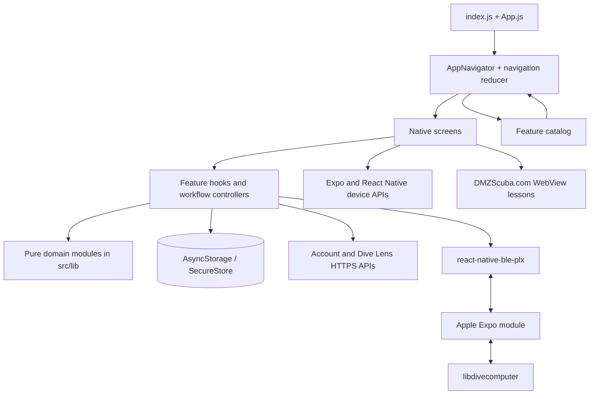

# DMZ Scuba

DMZ Scuba is an Expo / React Native companion app for scuba divers. It brings together interactive education, dive-planning calculators, a training dive computer, direct dive-computer downloads, a detailed local logbook, photo organization, AI-assisted photo identification, account features, and shareable dive cards.

This README is written for two audiences:

- [The plain-language tour](#plain-language-tour) explains what the app does and how its major pieces fit together without assuming software-development experience.
- [Under the hood](#under-the-hood) documents the architecture, data models, native integrations, storage, algorithms, and development workflow for contributors.

> [!IMPORTANT]
> DMZ Scuba’s calculators, simulations, safety scores, and AI identifications are educational and organizational tools. They do not replace formal training, manufacturer instructions, a properly configured real dive computer, gas analysis, equipment inspection, or conservative real-world dive planning.

## Project at a glance

| Area | What the diver sees | How it works |
| --- | --- | --- |
| Home | A short launch point for lessons, tools, and the logbook | Catalog-driven navigation and reusable native UI |
| Learn | Color-loss and Boyle’s Law labs, plus a dive-computer trainer | Secure website embeds for the labs; a native deterministic simulator for the trainer |
| Tools | Pressure, Nitrox, blending, gas-use, decompression, logbook, and Dive Lens tools | Framework-independent calculation modules wrapped in native screens |
| Logbook | Manual dives, computer downloads, profiles, photos, filters, statistics, exports, and backups | A versioned local data model in AsyncStorage plus an Apple native bridge to libdivecomputer |
| Dive Lens | Camera/library photo identification for marine life and gear | Local image preparation followed by an HTTPS request to the DMZ media API |
| Account | Sign-up, login, diver profile, certifications, and settings sync | Supabase authentication, DMZScuba.com account APIs, Turnstile, and SecureStore |
| Sharing | Custom social cards built from a logged dive | React Native layouts captured at a fixed export resolution and passed to the native share sheet |

## Plain-language tour

### The basic idea

Think of the app as five connected rooms:

1. **Home** is the front desk. It points to the most useful destinations without trying to show everything at once.
2. **Learn** explains dive science visually and lets a diver practice reading a simulated dive computer.
3. **Tools** contains the calculators, Dive Lens, and other practical utilities.
4. **Logbook** is the center of the app: dives can be entered manually or downloaded from a real dive computer, then searched, reviewed, analyzed, photographed, exported, or shared.
5. **More** contains account and app settings.

The bottom tab bar keeps those rooms stable. A lesson or tool opens as a temporary detail screen, and Back returns to the place that opened it.

### What stays on the phone and what leaves it

The app is intentionally local-first, but some features are connected services.

| Information or feature | Local or online? |
| --- | --- |
| Dive records and downloaded profile samples | Stored locally on the device |
| Logbook photos | The app stores links to camera-roll assets; matching does not upload the photos |
| Coarse location breadcrumbs | Stored locally and only when the diver opts in |
| Unit, calculator, graph, and location preferences | Stored locally; supported settings also sync to a signed-in account |
| Share-card preferences | Stored locally; the chosen background photo is not remembered between dives |
| Account profile and certifications | Stored through the online DMZ Scuba account service |
| Account refresh token | Stored in the device’s secure credential storage |
| Dive Lens image | Sent to the DMZ media API only when the diver asks for identification |
| Color-loss and Boyle’s Law labs | Loaded from DMZScuba.com inside an in-app browser view |
| Real dive-computer download | Runs locally over Bluetooth in a full iOS app build |

### A typical diver journey

A new user can explore the learning labs and calculators without creating an account. They can enter dives manually immediately. On a compatible full iOS build, they can connect a physical dive computer over Bluetooth and download its history.

Each physical download is preserved as a computer log. The app then determines whether two logs from different computers describe the same real dive. If they do, it presents one dive in the logbook while keeping both computers’ evidence underneath it. The diver can choose which computer is primary, inspect each recorded profile, and correct clock differences when needed.

Afterward, the diver can select a large batch of camera-roll images. Capture times are compared with dive times, likely matches are shown for review, duplicates are skipped, and the diver can reassign uncertain photos manually. A linked image can be viewed in the gallery or used as the background for a share card.

The logbook remains usable without an account or network connection. JSON backups, CSV exports, and UDDF exports give the diver a path to move or inspect their data outside the app.

## Feature-by-feature overview

### Home and navigation

`App.js` is deliberately small: it applies portrait-orientation behavior, safe-area support, the light status bar, the application navigator, and the shared number-keyboard accessory.

`AppNavigator` owns the current tab and temporary detail route through a reducer rather than a third-party navigation framework. The five persistent tabs are Home, Learn, Tools, Logbook, and More. Android’s hardware Back button uses the same navigation state, so route behavior is consistent with the on-screen Back controls.

The Learn and Tools menus are generated from one feature catalog. Titles, summaries, icons, featured placement, and route types come from that catalog, which prevents the Home screen, menus, and router from developing separate lists of features.

### Education

#### Underwater Color Loss

The color-loss lesson runs locally in React Native. Drag an original vector diver through a 0–40 m water column, recolor its mask, suit, tank, and fins, apply orange/pink/yellow safety colors, and move a flashlight over the diver, fish, and coral. Water presets change absorption; surface-versus-depth swatches and RGB transmission bars explain the result. The scene artwork is authored in `src/features/colorLoss/ColorScene.js`, with no downloaded sprite dependency.

`src/features/colorLoss/model.js` supplies a shared 4×5 RGB transform for the scene and live camera. Its exponential absorption coefficients come from the website lab; the native implementation removes the website's color-specific visibility floors and uses a normalized haze matrix so depth zero preserves the original image. Safety colors remain ordinary pigments in this model, not a simulation of fluorescent materials. This is an educational approximation, not a calibrated visibility or product-safety predictor. Background objects use their own depth, and the movable beam restores nearby color with a short light path and soft distance falloff.

Camera mode uses the local `modules/color-loss-camera` Expo module: AVFoundation plus Core Image on iOS, CameraX plus a TextureView color matrix on Android. Frames stay native, are never sent over the JavaScript bridge, and are not recorded or uploaded. The slider applies the same depth transform to real objects; holding Compare shows the original feed. Camera access is requested only after Enable Camera, and the camera view unmounts when the app backgrounds or the user leaves camera mode. Permission denial and unavailable hardware have explicit recovery states. Camera exposure and white balance affect the approximation.

Because this feature adds native code, rebuild the development/production app (`npx expo run:ios` or `npx expo run:android`); an over-the-air JavaScript update cannot add the camera module. The reef scene remains available when that module is absent. Run `npm run test:color-loss` for the color model checks. Physical-device verification should cover camera permission, depth/color changes, compare-and-release, orientation, background/resume, and repeated entry/exit.

#### Boyle’s Law Lab

The Boyle’s Law lesson makes the relationship between pressure and gas volume visible. It supports both a compression view and a breathing-gas-use comparison. Like the color lesson, the catalog route loads the maintained website version inside the app.

The WebView permits secure navigation on `www.dmzscuba.com`, sends unrelated web, mail, and telephone links to the operating system, rejects mixed content, displays loading and connection states, and can reload after a WebView process termination.

#### Dive Computer Trainer

The trainer is fully native and has two layers:

- **Guided lesson:** a structured course covering the two-button interface, menus, date/time, dive activation, NDL, controlled ascent, safety and deep stops, rapid-ascent warnings, Nitrox/MOD, planning, logbook navigation, and a final knowledge/practical check.
- **Free practice:** a simulator workspace with guided-dive, ascent-control, and decompression-response scenarios.

The displayed computer behaves like a small physical instrument, not a set of mobile tabs. Short and long button presses are interpreted differently, the LCD screen graph controls navigation, and warnings or stops temporarily change what the device presents.

### Dive Calculator

The calculator has five tabs. Calculations live in pure JavaScript modules so they can be tested independently from the screen.

| Tab | Capabilities |
| --- | --- |
| Pressure | Depth-to-absolute-pressure and absolute-pressure-to-depth conversions |
| Nitrox | Partial pressure, maximum operating depth, best mix, equivalent air depth, and optional equivalent narcotic depth |
| Blending | Partial-pressure Nitrox/Trimix fills, banked-mix top-offs, required bleed-down, oxygen/helium/air steps |
| Gas Use | Observed RMV from a completed dive and required gas at depth with a contingency reserve |
| Deco | A Bühlmann ZH-L16C tissue snapshot with selectable gradient factor and optional helium calculations |

The user can save a cylinder profile or choose a built-in tank preset. The app converts between metric and imperial input/display units while keeping calculation values in canonical metric units internally. Trimix mode is opt-in to keep helium-specific controls out of the way for recreational Nitrox users.

### Dive Logbook

The logbook supports substantially more than a list of dives:

- Manual entry and editing
- Direct Bluetooth downloads from real dive computers on iOS
- One canonical dive backed by one or more computer logs
- Computer priority and per-computer profile inspection
- Automatic and reviewed cross-computer reconciliation
- Split-dive detection and manual merge/split recovery
- Dive modes including open circuit, CCR, SCR, gauge, and freedive
- Site, date, depth, duration, water, temperature, visibility, gas, cylinders, equipment, buddies, operator, notes, tags, type, and rating fields
- Responsive profile charts with depth, temperature, cylinder pressure, oxygen, and setpoint overlays when data exists
- Full-screen chart scrubbing and per-sample readouts
- Search, multi-criteria filtering, stable sorting, and multi-select bulk editing
- Aggregate totals, site/year summaries, gas usage, SAC/RMV, safety, ascent, and depth trends
- Soft deletion, purge tools, diagnostics, integrity checking, repair, and snapshots
- Full/summary JSON, CSV, and UDDF export
- Additive JSON backup restoration with collision-safe ID remapping
- Timestamp-based photo matching, gallery browsing, and share-card creation

#### Understanding “Dive” versus “ComputerLog”

A **Dive** is the human-facing event: “the dive at Blue Heron Bridge on Saturday.” It owns user-edited facts and the summary shown throughout the app.

A **ComputerLog** is one machine’s recording of that event. It owns the device identity, original reported time, correction, depth samples, temperatures, pressures, decompression data, events, fingerprint, and calculated analytics.

This distinction matters when a diver wears two computers. The logbook counts one real dive, but it does not throw away either recording. It can surface one computer as primary while retaining the others for comparison.

#### Browsing, searching, and filtering

The default “All dives” folder shows each reconciled dive once. Additional folders group dives by physical computer, with a separate folder for manual entries. Divers can rank computers as primary, secondary, or tertiary; this priority influences which log supplies the displayed summary for multi-computer dives.

Search and filtering run against lightweight index rows rather than loading every full profile. Filters include text, date, depth, duration, temperature, SAC, oxygen percentage, rating, dive type, water type, dive mode, gas family, source, and whether a computer log exists. Sorting supports date, depth, duration, temperature, SAC, rating, site, and dive number. Missing values always sort last and ties have deterministic fallbacks, so lists do not jump between renders.

#### Statistics and analytics

At import time, the app derives values that would otherwise be expensive to calculate every time the list opens:

- Maximum and average ascent rate
- Time above the configured ascent-rate threshold
- Sawtooth/profile-reversal behavior
- Average depth
- SAC and RMV when usable cylinder-pressure data exists
- Maximum decompression ceiling
- A transparent safety score based on recorded profile facts and events

Across the whole logbook, it calculates total dives and bottom time, deepest and longest dives, first/last dates, dives by year/site, average and trend lines for SAC, RMV, average depth, and safety score, gas-mix counts, and rapid-ascent dive counts.

#### Photo organization

The photo importer reads Image Picker asset metadata on the device. It accepts a large multi-selection, extracts the best available capture timestamp, and compares it with each dive’s start/end window plus a 90-minute margin. Likely matches are ranked by distance from the actual dive interval, and uncertain or timestamp-free photos can be assigned manually.

Duplicate protection is applied at several boundaries:

1. Repeated assets in the same picker selection are removed.
2. Assets already linked anywhere in the active logbook are skipped before review.
3. Persistence performs another logbook-wide check in case separate import sessions overlap.
4. Schema normalization removes repeated photo references from older or imported records.

Asset ID is the strongest identity signal, with persisted ID and URI as fallbacks. Removing a photo from a dive removes only the app’s link; it never deletes the camera-roll image.

The gallery applies the same dive filters as the list and can sort photos by capture time or dive depth. When enough profile data exists, the full-screen viewer interpolates the diver’s depth at the photo’s capture time.

#### Backup and export

- **JSON backup** preserves normalized dives and full computer logs for restoration.
- **JSON export** can include full profiles or summary-only computer logs.
- **CSV summary** produces one row per dive for spreadsheets.
- **Full CSV** expands profile samples into rows with depth, temperature, pressure, oxygen, setpoint, CNS, NDL, and decompression fields.
- **UDDF 3.2.3** provides an XML interchange format with gas definitions, tanks, samples, events, and dive metadata.

Restoration is additive: it takes a raw snapshot first, keeps existing records, remaps colliding dive/log IDs, rewrites references, and imports the backup beside current data.

### Real dive-computer downloads

This is the most platform-specific part of the project. A full iOS build combines three layers:

1. `react-native-ble-plx` discovers the peripheral, handles permissions, connects, subscribes to notifications, and writes GATT characteristic data.
2. The local Expo module passes those bytes and write requests between JavaScript and native code.
3. libdivecomputer identifies the protocol/model, conducts the device conversation, parses dives, and emits structured records back to JavaScript.

The download service is a module-level singleton rather than screen state. A transfer therefore continues if the diver leaves the download panel to browse another logbook view. Screens subscribe to its status, progress, summary, and ring-buffer console.

The flow includes:

- Bluetooth permission and powered-on checks
- A 20-second scan with likely-computer/service hints
- Previously used devices as reconnect candidates
- Cleanup of stale CoreBluetooth connections before scanning
- Pairing priming and retry guidance for Suunto EON/D5 behavior
- Known-service characteristic selection with a writable/notifiable fallback
- Device-family and model resolution, including Oceanic/Pelagic BLE-name handling and DEVINFO refinement
- First-time full download, incremental “new dives” sync, full recovery download, and a force-reimport escape hatch
- Fingerprint-based same-computer duplicate detection
- Remembered device IDs and resolved models for later syncs
- Optional computer-clock synchronization only for protocol families that advertise support
- Cancellation, progress events, readable errors, and transfer logs
- Batched persistence followed by index rebuild and cross-computer reconciliation

The bridge is currently Apple-only. The rest of the React Native app has Android configuration, but real dive-computer download is not implemented for Android in this repository.

### Dive matching and reconciliation

Downloaded data is messy in realistic ways: two computers can disagree about time, sample at different intervals, or divide the same underwater session differently.

The matcher resamples depth profiles, compares their shapes at possible offsets, and combines that evidence with duration, depth, device identity, and reported start time. Whole-trip reconciliation looks for an in-order offset supported across multiple dives instead of trusting one coincidental pair. Clean clock offsets can be remembered and applied to the computer that was wrong.

It also detects “one long log versus several short logs” split-dive cases in either import order. Strong matches can merge automatically; ambiguous clock decisions become review cards. If the diver says two logs are separate, that negative decision is stored so the same proposal is not raised repeatedly. Manual merge, split, diagnostic, and full-book duplicate checks provide recovery when automatic matching is not enough.

### Dive Lens

Dive Lens accepts either a new camera photo or an existing library photo. The app prepares the selected image and sends base64 image data plus its MIME type to the DMZ media Worker over HTTPS. Requests have a 30-second timeout and return readable network, timeout, server, or malformed-result errors.

The client normalizes old and current API responses. Current structured results can describe:

- Identification and confidence level
- Evidence, uncertainty, alternatives, and suggestions for a better next photo
- Gear category, brand/model confidence, use, features, care, and safety notes
- Marine-life taxonomy, habitat, range, size, behavior, lookalikes, and conservation notes

Gear and marine-life profiles are mutually exclusive, uncertain values remain explicitly unknown, and the UI does not turn model output into equipment inspection, compatibility, authenticity, or operating-limit claims. The identification backend lives outside this repository.

### Dive share cards

From a logged dive, the diver can create a social image using the dive profile and selected statistics. The editor supports:

- Post (4:5), square (1:1), and story (9:16) shapes
- Summary or brief detail levels
- Small, medium, or large type
- One to four available statistics from dive time, depth, temperature, gas, pressure, and SAC
- Optional depth axis and editable watermark
- Several profile treatments, including clean line, glow, swell, bars, steps, mirror, and dots
- Classic, Techy, Elegant, Natural, Sunset, Mono, Neon, and Blueprint layouts
- A linked dive photo, another library image, or the theme’s gradient background

The preview fits the available screen, but export does not screenshot that small preview. A second off-screen card is rendered at a fixed 1080-pixel width and captured as JPEG, producing consistent output across phones. The result can be saved to Photos and opened in the native share sheet. Layout preferences persist; the chosen photo does not carry into the next dive.

### Account and settings

Account creation and login use Supabase Auth. A browser-based Cloudflare Turnstile challenge returns to the app through its `dmzscuba://` deep-link scheme, and the callback includes a state value to reject unrelated or stale responses. New accounts support email-code verification.

The app stores the refresh token with Expo SecureStore using device-only, when-unlocked accessibility. Access tokens remain in memory and are refreshed when necessary. Authenticated DMZScuba.com endpoints load/save the diver profile, certifications, app settings, and existing customer-record links.

The app remains useful while signed out. Settings are written locally first. When signed in, sanitized supported settings are loaded from the account and subsequent changes are debounced before syncing back. If remote saving fails, the local copy remains intact and the UI reports that sync can retry.

Configurable settings include:

- Depth, pressure, gas-volume, and temperature units
- Recreational Nitrox versus Trimix calculator mode
- Dive-profile line colors and thickness
- Opt-in background location breadcrumbs
- Logbook export, backup, and restore actions

### Optional location-assisted dive sites

Because GPS does not work underwater, the app does not try to record an underwater track. When explicitly enabled, it stores occasional coarse breadcrumbs that can suggest where the diver was shortly before descending or after surfacing.

The service asks for foreground permission before background permission. It uses balanced accuracy, a 750-meter movement interval, and an Android time interval of 20 minutes; iOS can pause updates when stationary. Points are retained for 90 days in a dedicated local store. Matching chooses the valid point closest to a dive’s time interval within a default one-hour window.

The background task is registered at application entry because iOS may relaunch the app in the background solely to deliver a location update. The native imports are guarded so an older build, Expo Go, or web environment without those modules does not crash on startup.

## Under the hood

### Technology and platform baseline

- Expo SDK `~57.0.19`
- React Native `0.86.3`
- React `19.2.3`
- React Native Web `0.21` through the Expo SDK toolchain
- JavaScript source with React hooks and functional components
- AsyncStorage for local application/domain data
- SecureStore for account refresh credentials
- React Native SVG for the offline color-loss lab; React Native WebView for the website Boyle’s Law interactive
- React Native BLE PLX plus a custom Apple Expo module for dive computers
- libdivecomputer `0.9.0`, pinned as a Git submodule
- React Native SVG for graphs, icons, and instrument visuals
- React Native View Shot, Media Library, and Sharing for social exports

Expo SDK 57’s documented minimums are Node 22.13.x, Android 7/API 36, and iOS 16.4. Use the exact [Expo SDK 57 documentation](https://docs.expo.dev/versions/v57.0.0/) when changing Expo APIs or dependencies.

### System map



The intended dependency direction is presentation → feature controller → domain/infrastructure. Pure simulation, calculation, matching, validation, and formatting modules do not import React Native, which is why the fast Node verification scripts can exercise them directly.

### Startup sequence

1. `index.js` registers the background-location task before React mounts.
2. Expo’s `registerRootComponent` starts the app.
3. `App.js` initializes safe-area/status-bar/orientation behavior and mounts the navigator.
4. `AppNavigator` restores local settings and the account session in parallel.
5. The active screen mounts its own feature controller. The logbook, for example, performs schema migration if needed, validates its index shape, rebuilds an incomplete index, and loads computer priority.

Optional native modules use guarded dynamic imports where an eager import could crash Expo Go, web, or a stale development build. This makes unsupported features fail in place with an explanation instead of preventing the whole app from launching.

### Repository boundaries

```text
App.js                         Minimal native application root
src/application/               Navigation state and top-level composition
src/screens/                   Complete screens and screen-local form state
src/features/                  Stateful workflows and cohesive capabilities
src/components/                Reusable UI patterns and interaction helpers
src/lib/                       Framework-independent domains and infrastructure
  diveLog/                     Schema, storage, matching, analytics, photos, exports
  diveSimulation/              Objective simulated environment and physiology
  virtualDiveComputer/         Virtual device state, menus, warnings, display model
  locationLog/                 Background breadcrumb task, storage, and correlation
modules/dive-computer-bridge/  JS/Swift/Objective-C/C bridge to libdivecomputer
plugins/                       Expo prebuild configuration
scripts/                       Node-based regression and structure checks
docs/                          Detailed architecture and phased feature notes
vendor/libdivecomputer/        Pinned upstream Git submodule
assets/                        Icons, splash art, and brand images
```

#### `src/application/`

Owns which destination is visible and connects global feature controllers to screens. It does not own calculator formulas, storage formats, or account transport.

#### `src/screens/`

Owns full-screen composition, temporary form drafts, local modal state, and presentation-specific formatting. The large `DiveLogScreen` composes many logbook views, while reusable rules remain under `src/lib/diveLog/` or `src/features/diveLog/`.

#### `src/features/`

Owns stateful capabilities that span components: account restoration/sync, app settings, download service subscriptions, logbook operations, simulation orchestration, lesson progress, share-card preferences, and catalog rendering.

#### `src/components/`

Provides the shared visual language: screen headers, tab bar, menu pages, cards, grouped sections, navigation rows, buttons, status banners, form controls, keyboard helpers, and reusable illustrations.

#### `src/lib/`

Owns pure calculations, normalized schemas, API clients, persistence functions, matching algorithms, formatting, and native-service boundaries. These files are the preferred home for logic that should be testable without rendering a screen.

### Logbook data and persistence

The current schema version is 2. Measurements are stored canonically in SI units—meters, seconds, Celsius, bar, liters, and kilograms—and converted only at the presentation/input boundary.

Each normalized Dive can carry identity/timestamps, dive number/source/sync state, log IDs, primary log, site coordinates, modes/types, water/profile summaries, gas mixes and tanks, decompression model, equipment, people, notes/tags/rating, linked photos, and deletion metadata. Each ComputerLog can carry device identity, fingerprint, reported and corrected time, full samples/events, gas/tanks, device metadata, and analytics.

AsyncStorage uses separate keys for each Dive and ComputerLog plus a compact index. This avoids parsing every full profile merely to draw the list. The index stores the fields required for folders, search, filters, sorting, statistics, and reconciliation hints. Its version stamp allows startup to detect stale rows.

Important reliability behavior includes:

- Batch computer import writes all new records before one index update, avoiding competing per-dive index writes.
- Startup compares stored-dive count with index count and can rebuild by scanning record keys, recovering orphaned records after interruption.
- Soft-deleted dives stay recoverable until an explicit purge.
- Raw snapshots preserve logbook keys before risky repair/restore work.
- Integrity checks identify missing references, malformed records, orphan logs, duplicate references, and index drift; repair rebuilds a consistent structure.
- Version-1 records can migrate into the Dive/ComputerLog model while retaining the earlier data as a backup.

### Simulation architecture

The simulator intentionally separates three concerns that are easy to blur together:

```text
Objective simulated dive
  depth, time, actual gas, tissues, NDL, CNS, stops, physical warnings
                      ↓ SIMULATION_UPDATED
Virtual dive computer
  configured gas, menus, screen selection, warning acknowledgement, device log
                      ↓ semantic display model
Instrument and training UI
  housing, LCD layout, buttons, controls, lesson prompts
```

`src/lib/diveSimulation/` is the source of truth for the physical scenario. It advances in deterministic one-simulated-second steps and separately records canonical profile samples every five simulated seconds. It calculates Bühlmann-style tissues, NDL, ceiling, oxygen exposure, ascent/descent rates, dive lifecycle, safety/deep stops, warnings, and objective events.

`src/lib/virtualDiveComputer/` is a separate device. It observes public simulation snapshots but owns its configured gas, units/settings, menus, planner, virtual logbook, screen graph, edits, button interpretation, warning presentation/acknowledgement, and flashing. Acknowledging an alarm changes presentation state; it never erases the physical condition.

The computer’s configured gas and the simulation’s actual breathing gas are deliberately independent. A mismatch is a valid training condition. Only an explicit simulation command changes what gas the virtual diver is breathing.

`src/features/diveComputer/ui/` renders a semantic display model. Housing geometry stays fixed across screens, scales from a 360 × 344 design, preserves a minimum readable width, caps tablet growth, and provides effective 44-point button targets. The UI does not recalculate decompression or warning facts.

Training observes both domains but neither domain imports training. Guided-step fabrication creates deterministic snapshots for lesson navigation and verification without making the lesson the source of truth for dive physics.

### Native bridge architecture

The Apple bridge is a local Expo module:

- JavaScript exposes download, cancellation, byte delivery, write completion, clock sync, version lookup, and event subscriptions.
- Swift registers the Expo module and promise/event surface.
- Objective-C implements the libdivecomputer iostream, descriptor/model selection, parser callbacks, progress, cancellation, and data mapping.
- Vendored C sources provide the protocol drivers and parsers.

During Expo prebuild, `plugins/withLibDiveComputer.js` stages the pinned submodule’s C sources into the pod root so CocoaPods can compile them. The podspec links the bridge. `withDevelopmentTeam.js` applies automatic iOS signing and allows the Apple team to be overridden with `EXPO_APPLE_TEAM_ID`.

libdivecomputer is an LGPL-2.1 dependency. Anyone distributing the app should review the upstream license and the project’s linking/distribution obligations rather than assuming the root license covers that dependency.

### Storage map

| Data | Store | Notes |
| --- | --- | --- |
| App settings | AsyncStorage | Sanitized on read and write |
| Tank profile | AsyncStorage | Preset/custom cylinder settings |
| Share-card options | AsyncStorage | Versioned preferences; no persistent selected photo |
| Dive index | AsyncStorage | Small list/filter/stat summary rows |
| Dive records | AsyncStorage | One key per canonical Dive |
| Computer logs | AsyncStorage | One key per imported machine recording |
| Device fingerprints/models/history | AsyncStorage | Supports incremental sync and reconnects |
| Clock corrections, priority, negative matches | AsyncStorage | Reconciliation decisions and device preferences |
| Snapshots | AsyncStorage | Recoverable raw logbook state |
| Location breadcrumbs | Separate AsyncStorage value | Opt-in, coarse, 90-day retention |
| Account refresh token | SecureStore | Device-only and available when unlocked |
| Account access token | Memory | Refreshed from the secure refresh token |

### External boundaries

This repository is the mobile client. It depends on systems maintained elsewhere:

- `www.dmzscuba.com` hosts the live interactive labs and authenticated account endpoints.
- Supabase provides account authentication/session APIs.
- A Cloudflare-hosted challenge flow provides Turnstile verification and returns through the app scheme.
- The DMZ media Worker provides Dive Lens identification.

Do not place service-role keys, private API secrets, signing credentials, certificates, or provisioning files in the repository. The Supabase publishable key in the client is intentionally public and must be protected by backend authorization policies, not secrecy.

## Building and running

### Requirements

- Git with submodule support
- Node.js 22.13.x or a compatible newer release
- npm
- Xcode and CocoaPods for iOS builds
- Android Studio / Android SDK for Android builds
- A physical iPhone and supported dive computer for end-to-end Bluetooth validation

Clone with the native dependency:

```bash
git clone --recurse-submodules https://github.com/dmz34705/dmzscuba-app.git
cd dmzscuba-app
npm install
```

If the repository was cloned without submodules:

```bash
git submodule update --init --recursive
```

Start Metro:

```bash
npm start
```

Run a platform:

```bash
npm run ios
npm run android
npm run web
```

Clear Metro state after native/configuration changes or suspicious stale bundles:

```bash
npx expo start --clear
```

Generated `ios/` and `android/` folders are intentionally ignored. Native configuration belongs in `app.json`, local Expo modules, and config plugins so it survives prebuild.

### Runtime support

| Environment | Expected behavior |
| --- | --- |
| Full iOS development/production build | Complete app, including Apple native dive-computer bridge |
| iOS simulator | Most UI/domain work; no meaningful physical BLE validation |
| Android build | General React Native features; no Android libdivecomputer bridge in this repository |
| Expo Go | Pure/native-standard areas may work, but custom/native workflows report that a full build is required |
| Web | Useful for compatible screens and domain work; Bluetooth, background location, secure native sharing, and camera behavior differ or are unavailable |

## Verification

The project uses focused Node scripts instead of one monolithic test runner. They validate pure calculations, schemas, migrations, storage recovery, feature wiring, simulator transitions, display geometry, account behavior, and important screen contracts.

Run all package checks before handing off a change:

```bash
npm run test:architecture
npm run test:account
npm run test:auth
npm run test:settings
npm run test:keyboard
npm run test:calculator
npm run test:integration
npm run test:lens
npm run test:tanks
npm run test:physics
npm run test:dive-simulation
npm run test:virtual-dive-computer
npm run test:dive-computer-ui
npm run test:dive-computer-workspace
npm run test:dive-computer
npm run test:dive-log
```

Then perform the Expo and bundle checks:

```bash
npx expo-doctor
npx expo export --platform ios
```

A successful bundle is not proof of runtime behavior. Native changes should also be tested in a rebuilt development client. Bluetooth changes require a physical device/computer; camera, permissions, background location, share-card output, large text, and narrow/tablet layouts require targeted visual testing.

## Contributor guide

### Adding a lesson or tool

1. Add the public metadata to `src/features/catalog/featureCatalog.js`.
2. Reuse or add the icon mapping in `FeatureIcon.js`.
3. Reuse an existing route type where possible.
4. Add a detail renderer to `AppNavigator.js` only when the feature introduces a genuinely new route type.
5. Put reusable calculations or validation in `src/lib/`.
6. Add a focused verification script or extend the closest existing one.

Home counts, Learn/Tools menus, public labels, featured placement, and routing should continue to derive from the catalog.

### Working rules

- Use `npx expo install` for Expo packages so versions align with SDK 57.
- Keep `App.js` small and keep navigation decisions in `src/application/`.
- Keep global sessions/preferences in feature hooks, not screen-local state.
- Keep calculations, schemas, matching, and conversion at the domain edge.
- Preserve canonical SI storage and convert only for input/display.
- Treat screens as presentation and workflow composition, not the source of domain truth.
- Reuse the established dark-blue, cyan, red, green, and amber design language.
- Respect safe-area insets, readable contrast, and minimum 44-point tap targets.
- Guard optional native modules when an eager import could break older builds or web.
- Update app permission copy whenever a capability changes.
- Add regression coverage for meaningful logic or architecture changes.
- Update the detailed document under `docs/` when a domain contract changes.

## Privacy, security, and safety boundaries

- Background location is off by default and requires an explicit user action plus OS permission.
- Location sampling is coarse and retained locally for a bounded period.
- Logbook photo matching is local; it does not send selected batches to a server.
- Dive Lens is different: the chosen image is transmitted for analysis after the user starts identification.
- Removing a photo link does not delete the source photo.
- Logbook data is local unless the diver explicitly shares/exports a file.
- Account tokens use SecureStore; secrets that authorize backend administration must never be shipped in the app.
- User and imported data are normalized before domain code consumes them.
- Network calls have bounded failures and user-readable error states.
- AI identifications and calculated/simulated decompression information must remain advisory and educational.

## Further reading

- [Architecture](docs/ARCHITECTURE.md)
- [Dive logbook plan and native handoff](docs/LOGBOOK_PLAN.md)
- [Dive Lens structured result contract](docs/DIVE_LENS.md)
- [Dive simulation domain](docs/DIVE_SIMULATION_PHASE_1.md)
- [Virtual dive computer domain](docs/VIRTUAL_DIVE_COMPUTER_PHASE_2.md)
- [Virtual instrument UI](docs/VIRTUAL_DIVE_COMPUTER_PHASE_3.md)
- [Expo SDK 57 reference](https://docs.expo.dev/versions/v57.0.0/)
